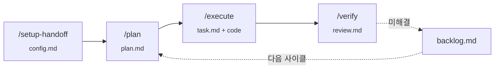

# Agent Handoff Skills

[English](README.md) | **한국어**

코딩 에이전트를 위한 엄격한 3단계 핸드오프 워크플로우 — `plan` → `execute` → `verify` — 컨텍스트 사이를 디스크 기반 상태로 이어줍니다.



## 왜 필요한가

같은 컨텍스트에서 일하는 에이전트는 자신이 만든 결과물을 제대로 검증하지 못합니다. 이 플러그인은 작업을 세 개의 스킬로 나누고 boundary를 강제하며, 상태를 `.handoff/*.md`에 남겨 verify를 새 채팅에서 돌릴 수 있게 합니다. 자세한 배경은 [docs/why-handoff.ko.md](docs/why-handoff.ko.md) 참고.

## 네 개의 스킬

| 스킬 | 사용 시점 | 읽음 | 씀 | 금지 |
|---|---|---|---|---|
| `/setup-handoff` | 프로젝트당 한 번 | manifest, 에이전트 가이드, 문서 트리 | `.handoff/config.md` | 코드, 빌드 명령 |
| `/plan` | 기능/수정 시작 시 | config, backlog | `.handoff/plan.md` | 코드, 빌드 명령 |
| `/execute` | `/plan` 이후 | config, plan | `.handoff/task.md` + 코드 | test, lint, plan 밖 변경 |
| `/verify` | `/execute` 이후, 새 채팅 | config, plan, task | `.handoff/review.md`, 정리 | 코드, typecheck (execute가 이미 실행) |

`/execute`는 config의 `typecheck`를 **read-only 컴파일 체크**로 실행합니다 — 타입 에러를 verify까지 끌고 가지 않고 한 단계 일찍 잡음. test/lint/plan-vs-code 판단은 `/verify`에 그대로 (fresh context가 핵심).

## 설치

### 범용 (모든 지원 에이전트 — 권장)

[`vercel-labs/skills`](https://github.com/vercel-labs/skills) 기반. Claude Code, Cursor, Codex, Gemini CLI, Aider 등 50개 이상의 에이전트에서 동작.

> **⚠️ 4개 스킬을 함께 설치하세요.** 스킬은 한 세트로 설계됐습니다: 각 스킬의 gate는 이전 단계가 쓴 상태를 기대합니다 (`/plan`은 `/setup-handoff`가 만든 `config.md`, `/execute`는 `plan.md`, `/verify`는 `task.md`). 부분 설치는 설치되지 않은 슬래시 명령을 가리키는 gate failure를 일으킵니다. `--skill '*'` (또는 `--all`)로 4개 모두 한 번에 설치하세요.

```bash
# 인터랙티브: 어느 에이전트에 설치할지 선택 (4개 스킬 기본 선택)
npx skills@latest add WillowRyu/agent-handoff

# 비인터랙티브: 4개 스킬 모두 Claude Code에 글로벌 설치
npx skills@latest add WillowRyu/agent-handoff --skill '*' -g -a claude-code -y
```

유용한 플래그: `-g` (글로벌, `~/`에 설치), `--list` (dry-run), `--skill '*'` (모든 스킬, 권장), `-a <agent>` (대상 에이전트). `npx skills@latest --help` 참고.

### Claude Code (플러그인 마켓플레이스 대안)

```bash
/plugin marketplace add WillowRyu/agent-handoff
/plugin install agent-handoff
```

## 워크플로우

```
/setup-handoff              # 한 번만
/plan "<작업 설명>"          # 무엇을 할지 기술
/execute                    # 새 채팅에서 권장
/verify                     # 또 다른 새 채팅에서 권장
```

각 단계의 실제 산출물 예시는 [docs/examples/](docs/examples/) 참고.

## 권한 (Permissions)

각 스킬은 특정 파일을 씁니다. 플러그인으로 설치된 경우 번들된 hook (`hooks/hooks.json`)이 `.handoff/**` 쓰기를 자동 승인합니다. 다른 설치 경로나 다른 에이전트는 명시적인 권한 규칙이 필요합니다.

| 스킬 | 필요 권한 |
|---|---|
| `setup-handoff` | repo에 대한 Read; `.handoff/config.md`에 대한 Write/Edit |
| `plan` | repo에 대한 Read; `.handoff/plan.md`와 `.handoff/backlog.md`에 대한 Write/Edit |
| `execute` | plan에 명시된 소스 파일에 대한 Edit; `.handoff/task.md`에 대한 Write; plan의 sync commands와 config의 `typecheck`를 위한 `Bash` |
| `verify` | test/lint와 `git diff`(실제 변경분과 plan 비교용)을 위한 `Bash`; `.handoff/{plan,task,review,backlog}.md`에 대한 Edit/Delete |

> **프로젝트 요구사항:** 프로젝트는 git 저장소여야 합니다. `/verify`의 plan-vs-code 검증이 `git diff`로 plan에 적힌 변경이 실제로 들어갔는지 확인하고 plan 밖 변경도 잡아냅니다. git 환경이 아니면 이 검증이 파일 존재 확인 수준으로 약화됩니다.

### Claude Code

**플러그인 설치 (`/plugin install agent-handoff`)**: 번들된 PreToolUse hook (`hooks/hooks.json`)이 `.handoff/**` 쓰기를 자동 승인합니다. 플러그인 로드를 위한 첫 prompt만 수락하면 그 후 매번 권한을 묻지 않습니다.

**`npx skills` 설치 또는 다른 경로**: `npx skills add`는 SKILL.md 파일만 복사하고 hook은 같이 안 옵니다. settings에 권한 규칙을 명시적으로 추가하세요:

```json
{
  "permissions": {
    "allow": [
      "Write(.handoff/**)",
      "Edit(.handoff/**)"
    ]
  }
}
```

`~/.claude/settings.json` (글로벌) 또는 `.claude/settings.json` (프로젝트)에 추가.

### 다른 에이전트

Cursor, Codex, Gemini CLI, Aider 등은 각자의 권한 모델이 있습니다. 스킬은 `.handoff/`와 plan에 명시된 소스 파일 외에는 손대지 않으니, 기존 scoping 관행을 그대로 적용하면 됩니다.

## 설정

`/setup-handoff`이 `.handoff/config.md`를 작성합니다. 평범한 markdown 파일이라 언제든 직접 편집하거나 에이전트에게 편집을 시킬 수 있습니다 — 검증 명령, 응답 언어, 컨벤션 doc 경로, 문서 인덱스 추가/수정 모두 자유. 스킬들은 사이클 도중 `config.md`를 건드리지 않으므로 (`/plan`, `/execute`, `/verify`는 read-only) 사이클 사이에 점진적으로 편집해도 안전합니다.

`/setup-handoff`를 다시 돌리면 `config.md`를 처음부터 다시 작성 (커스텀 추가분 유실), `/setup-handoff --auto`는 인터뷰를 완전히 건너뜁니다 (자동 감지 실패 항목만 묻는 fallback 포함).

## 범위

- 4개 스킬, 엄격한 boundary와 `.handoff/*.md` 디스크 기반 핸드오프
- Stack-agnostic + **모노레포 인식** 스캔 (pnpm/npm/yarn/turbo/lerna/nx/cargo/go workspaces; workspace 별 docs + verification 후보)
- Setup 인터뷰가 **응답 언어를 가장 먼저** 물음 — 그 후의 모든 출력 (status 메시지, 작성되는 `.md` 파일)이 해당 언어로
- Doc index는 클릭 가능한 markdown 링크 + 짧은 설명
- **Plan이 verification 범위 결정** — `/verify`는 `plan.md`의 `## Verification plan`에 적힌 명령만 실행 (docs-only 변경 같으면 rationale과 함께 전체 skip); 섹션이 없으면 `config.md`로 fallback
- **`/execute`의 컴파일 체크** — config의 `typecheck`를 execute 안에서 safety net으로 실행. verify 가기 전에 타입 에러 잡고, plan 범위 안에서 1회 fix 시도 후 blocker. (v0.3.0)
- **위험 태그 change list** — plan 항목에 `low` / `medium` / `high` 위험 태그 부여 가능. execute가 태그로 항목별 체크 빈도를 조절 (low = 끝에 1회, medium = 항목별 컴파일 체크, high = 항목별 체크 + 항목별 task.md 갱신). 태그는 granularity만, 권한은 불변. (v0.3.0)
- **다단계 plan (`## Phases`)** — 큰 작업을 여러 plan→execute→verify 사이클에 걸쳐 진행. verify가 phase 통과 시 마커만 advance하고 마지막 phase까지 plan.md 유지. Backlog 정리도 마지막 phase까지 보류. (v0.3.0)
- 선택적 **병렬화** — `/plan`이 `## Parallelization`에 독립 단위 식별; `/execute`가 host(Claude Code Task tool 등) 지원 시 group별 subagent로 분할 dispatch
- setup-handoff의 `--auto` 모드 (인터뷰 스킵, 자동 감지 실패 항목만 fallback)
- verify 통과 시 backlog 자동 정리 (single-cycle 또는 final-phase에서만)

## 제외 (Out of scope)

- `/setup-handoff --refresh` (지금은 config.md 수동 편집)
- backlog 수동 조작 (`/verify --close-backlog ...`)
- 추가 스킬 (`git-push`, `pr-analyzer`, `verify-all` — v2 가능성)
- Claude Code 외 도구 형식으로의 자동 변환

## 라이선스

MIT.
