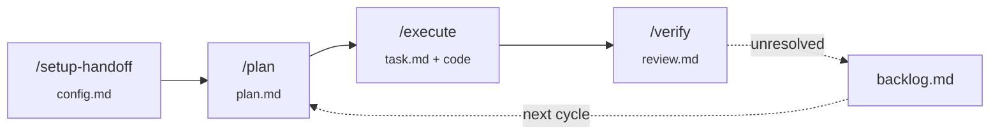

# Agent Handoff Skills

**English** | [한국어](README.ko.md)

Strict 3-stage handoff workflow for coding agents — `plan` → `execute` → `verify` — with disk-backed state for cross-context handoff.



## Why

Agents working in a single context tend to skip verification of their own output. This plugin splits the work into three skills with strict boundaries, persisting state to `.handoff/*.md` so verify can run in a fresh chat. See [docs/why-handoff.md](docs/why-handoff.md) for the long version.

## The four skills

| Skill | When | Reads | Writes | Forbidden |
|---|---|---|---|---|
| `/setup-handoff` | once per project | manifests, agent docs, doc tree | `.handoff/config.md` | code, build commands |
| `/plan` | starting a feature/fix | config, backlog | `.handoff/plan.md` | code, build commands |
| `/execute` | after `/plan` | config, plan | `.handoff/task.md` + code | tests, lint, mutations outside plan |
| `/verify` | after `/execute`, fresh chat | config, plan, task | `.handoff/review.md`, cleans up | code, typecheck (already run by execute) |

`/execute` runs the **read-only compile check** (config's `typecheck`) as a safety net — type errors get caught one step earlier instead of waiting for `/verify`. Tests, lint, and plan-vs-code judgment stay with `/verify` (fresh context is the point).

## Install

### Universal (any supported agent — recommended)

Powered by [`vercel-labs/skills`](https://github.com/vercel-labs/skills), which works with Claude Code, Cursor, Codex, Gemini CLI, Aider, and 50+ other agents.

> **⚠️ Install all four skills together.** The skills are designed as a set: each one's gate expects state written by the previous step (`/plan` needs `config.md` from `/setup-handoff`, `/execute` needs `plan.md`, `/verify` needs `task.md`). Partial installs will surface gate failures pointing to slash commands that aren't installed. Use `--skill '*'` (or `--all`) to install all four at once.

```bash
# Interactive: pick which agents to install into (selects all 4 skills by default)
npx skills@latest add WillowRyu/agent-handoff

# Non-interactive: install all 4 skills globally for Claude Code
npx skills@latest add WillowRyu/agent-handoff --skill '*' -g -a claude-code -y
```

Useful flags: `-g` (global, into `~/`), `--list` (dry-run), `--skill '*'` (all skills, recommended), `-a <agent>` (target agent). See `npx skills@latest --help`.

### Claude Code (plugin marketplace alternative)

```bash
/plugin marketplace add WillowRyu/agent-handoff
/plugin install agent-handoff
```

## Workflow

```
/setup-handoff              # once
/plan "<task description>"  # describe what you want
/execute                    # ideally in a fresh chat
/verify                     # ideally in another fresh chat
```

See [docs/examples/](docs/examples/) for concrete artifacts at each stage.

## Permissions

Each skill writes specific files. Pre-allowing the handoff-state writes in your agent's permission settings avoids per-prompt friction; everything else (source-file edits during `/execute`, `Bash` during `/verify`) follows your existing project conventions.

| Skill | Needs |
|---|---|
| `setup-handoff` | Read on the repo; Write/Edit on `.handoff/config.md` |
| `plan` | Read on the repo; Write/Edit on `.handoff/plan.md` and `.handoff/backlog.md` |
| `execute` | Edit on source files listed in the plan; Write on `.handoff/task.md`; `Bash` for the plan's sync commands AND config's `typecheck` |
| `verify` | `Bash` for test/lint (typecheck stays with execute); Edit/Delete on `.handoff/{plan,task,review,backlog}.md` |

### Claude Code

Add to `~/.claude/settings.json` (global) or `.claude/settings.json` (project) to pre-allow handoff state writes:

```json
{
  "permissions": {
    "allow": [
      "Write(.handoff/**)",
      "Edit(.handoff/**)"
    ]
  }
}
```

### Other agents

Cursor, Codex, Gemini CLI, Aider, etc. each have their own permission models. The skills don't reach outside `.handoff/` and the source files explicitly listed in the plan, so apply your existing scoping conventions.

## Configuration

`/setup-handoff` writes `.handoff/config.md`. Edit it directly to change verification commands, response language, or doc paths. Re-running `/setup-handoff` overwrites; `/setup-handoff --auto` skips the interview entirely (falls back to asking only for items it couldn't auto-detect).

## What's in scope

- 4 skills with strict boundaries and disk-backed handoff via `.handoff/*.md`
- Stack-agnostic, **monorepo-aware** scanning (pnpm/npm/yarn/turbo/lerna/nx/cargo/go workspaces; per-workspace docs + verification candidates)
- Setup interview asks **response language first** — every subsequent output (status messages, written `.md` files) uses that language
- Doc index uses clickable markdown links with short descriptions
- **Plan-decided verification scope** — `/verify` runs only what `plan.md`'s `## Verification plan` lists (or skips entirely with rationale for docs-only changes); falls back to `config.md` only if plan omits the section
- **Compile check in `/execute`** — config's `typecheck` runs as the safety net inside execute; type errors caught before verify, with single in-plan fix attempt before blocker (v0.3.0)
- **Risk-tagged change list items** — plan items can carry `low` / `medium` / `high` risk; execute uses tags to adjust per-item check granularity (low = end-of-batch only, medium = per-item compile check, high = per-item check + per-item task.md update). Tags govern granularity, never authority. (v0.3.0)
- **Multi-phase plans** — `## Phases` section lets a single plan span multiple plan→execute→verify cycles; verify advances markers on pass and retains plan.md until the final phase. Backlog closure deferred to last phase. (v0.3.0)
- Optional **parallelization** — `/plan` identifies independent units in `## Parallelization`; `/execute` can dispatch one subagent per group when the host supports it (Claude Code's Task tool, etc.)
- `--auto` mode for setup-handoff (skip interview, per-item fallback when detection fails)
- Backlog auto-resolve on verify pass (single-cycle or final-phase only)

## What's out of scope (v1)

- `/setup-handoff --refresh` (manually edit config for now)
- Manual backlog operations (`/verify --close-backlog ...`)
- More skills (`git-push`, `pr-analyzer`, `verify-all` — possibly v2)
- Auto-conversion to non-Claude-Code tool formats

## License

MIT.
